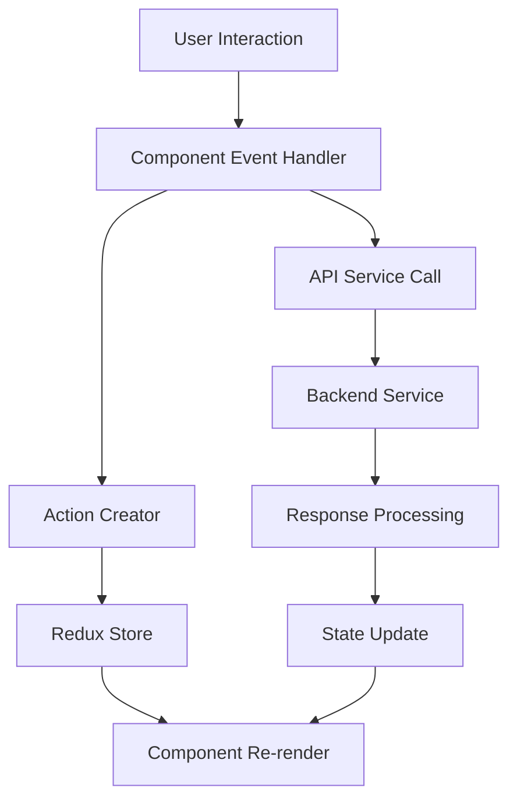
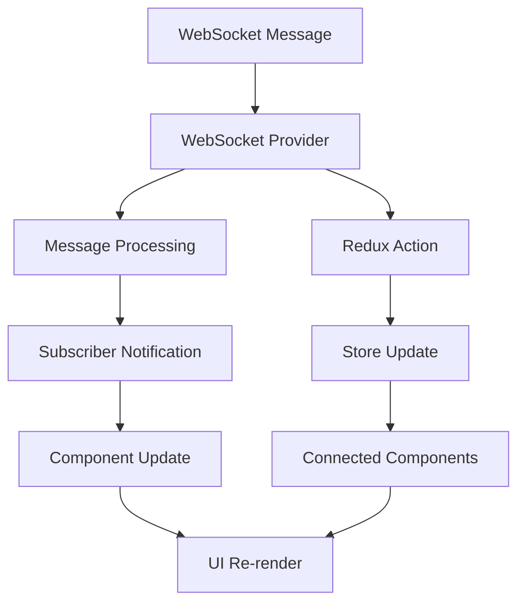
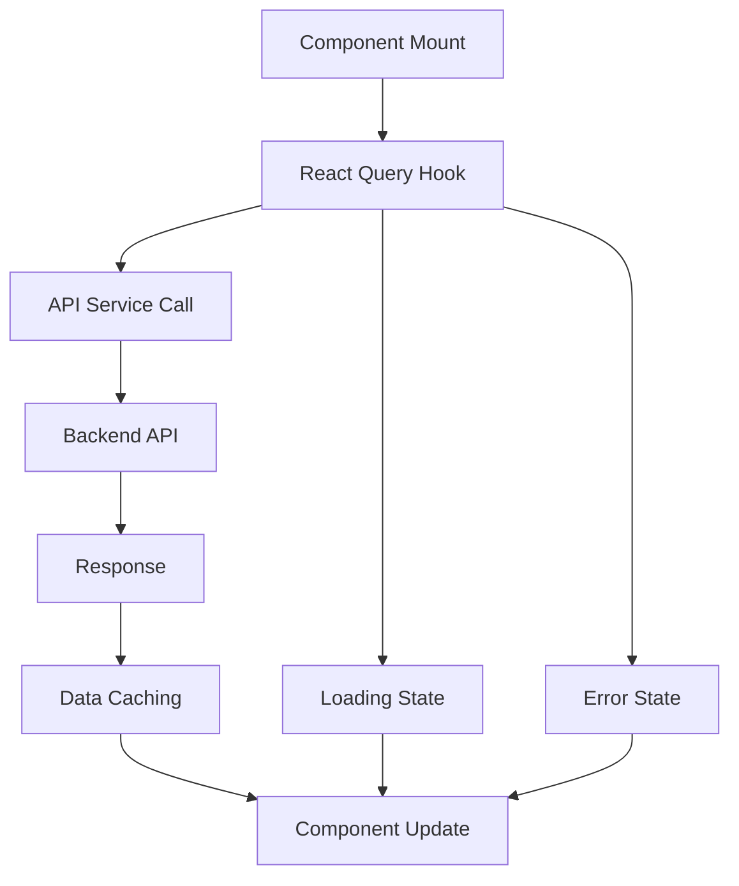

# Enterprise Dashboard Frontend - Architecture Documentation

## Overview

The Enterprise Dashboard Frontend is a comprehensive React-based web application that serves as the user interface for the ML Security platform. It provides a modern, responsive, and interactive dashboard for managing machine learning models, monitoring security testing, analyzing performance metrics, and orchestrating the entire ML Security ecosystem through an intuitive web interface.

## Architecture Principles

### 1. Component-Based Architecture
- **Modular Components**: Reusable, self-contained UI components
- **Composition over Inheritance**: Building complex UIs from simple components
- **Single Responsibility**: Each component has a clear, focused purpose
- **Props Interface**: Well-defined component interfaces

### 2. State Management
- **Redux Toolkit**: Centralized state management with Redux
- **React Query**: Server state management and caching
- **Local State**: Component-level state for UI interactions
- **WebSocket State**: Real-time state updates

### 3. Modern React Patterns
- **Functional Components**: Modern React with hooks
- **Custom Hooks**: Reusable stateful logic
- **Context API**: Global state sharing
- **Error Boundaries**: Graceful error handling

### 4. Performance Optimization
- **Code Splitting**: Lazy loading of components
- **Memoization**: React.memo and useMemo for optimization
- **Virtual Scrolling**: Efficient rendering of large lists
- **Image Optimization**: Optimized asset loading

## System Architecture

### Core Components

#### 1. Application Structure
```typescript
// Main App component with routing and providers
const App: React.FC = () => {
  return (
    <QueryClientProvider client={queryClient}>
      <ThemeProvider theme={theme}>
        <CssBaseline />
        <WebSocketProvider>
          <Router>
            <ErrorBoundary>
              <NavigationMenu />
              <Routes>
                {/* Route definitions */}
              </Routes>
            </ErrorBoundary>
          </Router>
        </WebSocketProvider>
      </ThemeProvider>
    </QueryClientProvider>
  );
};
```

**Key Features:**
- **React Router**: Client-side routing and navigation
- **Material-UI Theme**: Consistent design system
- **Error Boundaries**: Graceful error handling
- **WebSocket Integration**: Real-time communication

#### 2. State Management Architecture

**Redux Store Structure:**
```typescript
// Store slices for different domains
const store = configureStore({
  reducer: {
    models: modelsSlice,
    training: trainingSlice,
    analytics: analyticsSlice,
    redTeam: redTeamSlice,
    businessMetrics: businessMetricsSlice,
    dataPrivacy: privacySlice,
    system: systemSlice,
    monitoring: monitoringSlice,
    cache: cacheSlice,
    data: dataSlice,
    experiments: experimentsSlice
  }
});
```

**React Query Integration:**
```typescript
// Server state management
const queryClient = new QueryClient({
  defaultOptions: {
    queries: {
      retry: 3,
      staleTime: 5 * 60 * 1000, // 5 minutes
      cacheTime: 10 * 60 * 1000, // 10 minutes
    },
  },
});
```

#### 3. API Service Layer

**Centralized API Service:**
```typescript
// Comprehensive API service with multiple endpoints
export const apiService = {
  // Dashboard & System Health
  getDashboardMetrics: () => api.get('/dashboard/metrics'),
  getServicesHealth: () => api.get('/services/health'),
  
  // Model Management
  getAvailableModels: () => api.get('/models/available'),
  loadModel: (modelName: string) => modelApi.post('/load', { model_name: modelName }),
  predictModel: (text: string, modelName?: string) => modelApi.post('/predict', { text, model_name: modelName }),
  
  // Training Operations
  getTrainingJobs: () => api.get('/training/jobs'),
  startTraining: (config: any) => api.post('/training/start', config),
  
  // Analytics & Monitoring
  getAnalyticsSummary: () => api.get('/analytics/summary'),
  getRedTeamResults: () => api.get('/red-team/results'),
  
  // Business Metrics & Data Privacy
  getBusinessKPIs: () => api.get('/kpis'),
  getDataPrivacyCompliance: () => api.get('/compliance')
};
```

**Key Features:**
- **Multiple API Instances**: Separate instances for different services
- **Request/Response Interceptors**: Logging and error handling
- **Timeout Management**: Configurable timeouts per service
- **Error Handling**: Comprehensive error handling and retry logic

#### 4. WebSocket Integration

**Real-time Communication:**
```typescript
// WebSocket context for real-time updates
export const WebSocketProvider: React.FC<WebSocketProviderProps> = ({ children }) => {
  const [isConnected, setIsConnected] = useState(false);
  const [lastMessage, setLastMessage] = useState<WebSocketMessage | null>(null);
  const ws = useRef<WebSocket | null>(null);
  
  // Connection management
  const connect = () => {
    const wsUrl = process.env.REACT_APP_WS_URL || 'ws://localhost:8007/ws';
    ws.current = new WebSocket(wsUrl);
    
    ws.current.onopen = () => setIsConnected(true);
    ws.current.onmessage = (event) => {
      const message = JSON.parse(event.data);
      setLastMessage(message);
      // Notify subscribers
    };
    ws.current.onclose = () => {
      setIsConnected(false);
      // Auto-reconnect logic
    };
  };
};
```

**Key Features:**
- **Auto-Reconnection**: Automatic reconnection on disconnect
- **Message Broadcasting**: System-wide message distribution
- **Subscription Management**: Event-based subscriptions
- **Connection Status**: Real-time connection monitoring

### Component Architecture

#### 1. Layout Components

**Navigation System:**
```typescript
// Main navigation component
const NavigationMenu: React.FC = () => {
  return (
    <AppBar position="static">
      <Toolbar>
        <Typography variant="h6">ML Security Dashboard</Typography>
        <NavigationItems />
        <UserMenu />
      </Toolbar>
    </AppBar>
  );
};
```

**Dashboard Layout:**
```typescript
// Main dashboard layout
const DashboardLayout: React.FC = ({ children }) => {
  return (
    <Box sx={{ display: 'flex' }}>
      <Sidebar />
      <MainContent>
        {children}
      </MainContent>
    </Box>
  );
};
```

#### 2. Feature Components

**Model Management:**
- **ModelRegistry**: Model listing and management
- **ModelTesting**: Model testing interface
- **ModelPerformance**: Performance monitoring
- **ModelLoading**: Model loading/unloading

**Training Management:**
- **TrainingQueue**: Training job management
- **DataManagement**: Training data management
- **DataAugmentation**: Data augmentation tools
- **TrainingConfig**: Configuration management

**Analytics & Monitoring:**
- **AnalyticsDashboard**: Analytics overview
- **PerformanceAnalytics**: Performance analysis
- **DriftDetection**: Drift monitoring
- **SecurityMetrics**: Security metrics

**Red Team Testing:**
- **RedTeamDashboard**: Security testing overview
- **AttackSimulation**: Attack simulation interface
- **VulnerabilityAssessment**: Vulnerability analysis
- **ComplianceTesting**: Compliance testing

#### 3. Shared Components

**Charts & Visualizations:**
```typescript
// Reusable chart components
const BarChart: React.FC<BarChartProps> = ({ data, options }) => {
  return (
    <ResponsiveContainer width="100%" height={300}>
      <BarChart data={data}>
        <XAxis dataKey="name" />
        <YAxis />
        <Tooltip />
        <Bar dataKey="value" fill="#8884d8" />
      </BarChart>
    </ResponsiveContainer>
  );
};
```

**Data Tables:**
```typescript
// Reusable data table component
const DataGrid: React.FC<DataGridProps> = ({ columns, data, pagination }) => {
  return (
    <MuiDataGrid
      rows={data}
      columns={columns}
      pagination={pagination}
      pageSizeOptions={[10, 25, 50, 100]}
    />
  );
};
```

**Status Indicators:**
```typescript
// Status indicator component
const StatusIndicator: React.FC<StatusIndicatorProps> = ({ status, label }) => {
  const getColor = (status: string) => {
    switch (status) {
      case 'healthy': return 'success';
      case 'degraded': return 'warning';
      case 'unhealthy': return 'error';
      default: return 'default';
    }
  };
  
  return (
    <Chip
      label={label}
      color={getColor(status)}
      variant="outlined"
    />
  );
};
```

## Data Flow Architecture

### 1. User Interaction Flow



### 2. Real-time Data Flow



### 3. API Data Flow



## Technology Stack

### 1. Core Technologies
- **React 18**: Modern React with hooks and concurrent features
- **TypeScript**: Type-safe JavaScript development
- **Material-UI (MUI)**: Component library and design system
- **React Router**: Client-side routing
- **Redux Toolkit**: State management
- **React Query**: Server state management

### 2. Visualization & Charts
- **Recharts**: Chart library for data visualization
- **MUI X Data Grid**: Advanced data table component
- **Framer Motion**: Animation library
- **Custom Charts**: Custom visualization components

### 3. Development Tools
- **Vite**: Fast build tool and development server
- **ESLint**: Code linting and formatting
- **Prettier**: Code formatting
- **TypeScript**: Static type checking
- **Jest**: Unit testing framework
- **Playwright**: End-to-end testing

### 4. Build & Deployment
- **Docker**: Containerization
- **Nginx**: Web server and reverse proxy
- **Multi-stage Build**: Optimized production builds
- **Environment Configuration**: Environment-specific settings

## Component Architecture

### 1. Page Components

**Dashboard Pages:**
```typescript
// Main dashboard page
const EnhancedDashboard: React.FC = () => {
  const { data: metrics, isLoading } = useQuery('dashboard-metrics', apiService.getDashboardMetrics);
  const { data: health } = useQuery('services-health', apiService.getServicesHealth);
  
  return (
    <DashboardLayout>
      <Grid container spacing={3}>
        <Grid item xs={12} md={6}>
          <MetricCard title="Total Models" value={metrics?.total_models} />
        </Grid>
        <Grid item xs={12} md={6}>
          <MetricCard title="System Health" value={health?.overall_health} />
        </Grid>
      </Grid>
    </DashboardLayout>
  );
};
```

**Model Management Pages:**
```typescript
// Model registry page
const ModelRegistry: React.FC = () => {
  const { data: models, isLoading } = useQuery('available-models', apiService.getAvailableModels);
  const [selectedModel, setSelectedModel] = useState<string | null>(null);
  
  return (
    <DashboardLayout>
      <ModelList models={models} onSelect={setSelectedModel} />
      {selectedModel && <ModelDetails model={selectedModel} />}
    </DashboardLayout>
  );
};
```

### 2. Custom Hooks

**API Hooks:**
```typescript
// Custom hook for model operations
export const useModelAPI = () => {
  const queryClient = useQueryClient();
  
  const loadModel = useMutation(apiService.loadModel, {
    onSuccess: () => {
      queryClient.invalidateQueries('available-models');
    }
  });
  
  const predictModel = useMutation(apiService.predictModel);
  
  return { loadModel, predictModel };
};
```

**WebSocket Hooks:**
```typescript
// Custom hook for WebSocket subscriptions
export const useWebSocketSubscription = (eventType: string, callback: (data: any) => void) => {
  const { subscribe, unsubscribe } = useWebSocket();
  
  useEffect(() => {
    subscribe(eventType, callback);
    return () => unsubscribe(eventType, callback);
  }, [eventType, callback, subscribe, unsubscribe]);
};
```

### 3. State Management

**Redux Slices:**
```typescript
// Model management slice
const modelsSlice = createSlice({
  name: 'models',
  initialState: {
    models: [],
    selectedModel: null,
    loading: false,
    error: null
  },
  reducers: {
    setModels: (state, action) => {
      state.models = action.payload;
    },
    setSelectedModel: (state, action) => {
      state.selectedModel = action.payload;
    },
    setLoading: (state, action) => {
      state.loading = action.payload;
    }
  }
});
```

## Styling & Theming

### 1. Material-UI Theme
```typescript
// Custom theme configuration
const theme = createTheme({
  palette: {
    mode: 'dark',
    primary: {
      main: '#00bcd4',
    },
    secondary: {
      main: '#ff4081',
    },
    background: {
      default: '#0a0a0a',
      paper: '#1a1a1a',
    },
  },
  typography: {
    fontFamily: '"Inter", "Roboto", "Helvetica", "Arial", sans-serif',
  },
});
```

### 2. Component Styling
- **Styled Components**: Emotion-based styling
- **CSS-in-JS**: Component-scoped styling
- **Theme Integration**: Consistent design tokens
- **Responsive Design**: Mobile-first approach

## Performance Optimization

### 1. Code Splitting
```typescript
// Lazy loading of components
const ModelRegistry = lazy(() => import('./pages/Models/ModelRegistry'));
const TrainingQueue = lazy(() => import('./pages/Training/TrainingQueue'));

// Route-based code splitting
<Route path="/models" element={
  <Suspense fallback={<LoadingSkeleton />}>
    <ModelRegistry />
  </Suspense>
} />
```

### 2. Memoization
```typescript
// Memoized components
const ModelCard = React.memo<ModelCardProps>(({ model, onSelect }) => {
  return (
    <Card onClick={() => onSelect(model)}>
      <CardContent>
        <Typography variant="h6">{model.name}</Typography>
        <StatusIndicator status={model.status} />
      </CardContent>
    </Card>
  );
});
```

### 3. Virtual Scrolling
```typescript
// Virtual scrolling for large lists
const VirtualizedList: React.FC<VirtualizedListProps> = ({ items, renderItem }) => {
  return (
    <FixedSizeList
      height={400}
      itemCount={items.length}
      itemSize={50}
      itemData={items}
    >
      {({ index, style, data }) => (
        <div style={style}>
          {renderItem(data[index], index)}
        </div>
      )}
    </FixedSizeList>
  );
};
```

## Error Handling & Resilience

### 1. Error Boundaries
```typescript
// Error boundary component
class ErrorBoundary extends React.Component<ErrorBoundaryProps, ErrorBoundaryState> {
  constructor(props: ErrorBoundaryProps) {
    super(props);
    this.state = { hasError: false, error: null };
  }
  
  static getDerivedStateFromError(error: Error): ErrorBoundaryState {
    return { hasError: true, error };
  }
  
  componentDidCatch(error: Error, errorInfo: React.ErrorInfo) {
    console.error('Error caught by boundary:', error, errorInfo);
  }
  
  render() {
    if (this.state.hasError) {
      return <ErrorFallback error={this.state.error} />;
    }
    
    return this.props.children;
  }
}
```

### 2. API Error Handling
```typescript
// API error handling
api.interceptors.response.use(
  (response) => response,
  (error) => {
    if (error.response?.status === 401) {
      // Handle authentication error
      redirectToLogin();
    } else if (error.response?.status >= 500) {
      // Handle server error
      showErrorNotification('Server error occurred');
    }
    return Promise.reject(error);
  }
);
```

### 3. Retry Logic
```typescript
// Retry logic for failed requests
const queryClient = new QueryClient({
  defaultOptions: {
    queries: {
      retry: (failureCount, error) => {
        if (error.status === 404) return false;
        return failureCount < 3;
      },
      retryDelay: (attemptIndex) => Math.min(1000 * 2 ** attemptIndex, 30000),
    },
  },
});
```

## Security Architecture

### 1. Input Validation
- **Client-side Validation**: Form validation and sanitization
- **Type Safety**: TypeScript for compile-time type checking
- **XSS Prevention**: Sanitized rendering of user input
- **CSRF Protection**: CSRF token validation

### 2. Authentication & Authorization
- **Role-based Access**: Granular permission system
- **Session Management**: Secure session handling
- **Token Refresh**: Automatic token renewal

### 3. Data Security
- **HTTPS Only**: Secure communication
- **Content Security Policy**: XSS protection
- **Secure Headers**: Security headers configuration
- **Data Encryption**: Client-side data encryption

## Testing Strategy

### 1. Unit Testing
```typescript
// Component unit tests
describe('ModelCard', () => {
  it('renders model information correctly', () => {
    const model = { name: 'test-model', status: 'loaded' };
    render(<ModelCard model={model} onSelect={jest.fn()} />);
    
    expect(screen.getByText('test-model')).toBeInTheDocument();
    expect(screen.getByText('loaded')).toBeInTheDocument();
  });
});
```

### 2. Integration Testing
```typescript
// API integration tests
describe('Model API Integration', () => {
  it('loads models successfully', async () => {
    const { result } = renderHook(() => useQuery('models', apiService.getAvailableModels));
    
    await waitFor(() => {
      expect(result.current.isSuccess).toBe(true);
      expect(result.current.data).toBeDefined();
    });
  });
});
```

### 3. End-to-End Testing
```typescript
// E2E tests with Playwright
test('user can load and test a model', async ({ page }) => {
  await page.goto('/models');
  await page.click('[data-testid="load-model-button"]');
  await page.fill('[data-testid="model-name-input"]', 'test-model');
  await page.click('[data-testid="submit-button"]');
  
  await expect(page.locator('[data-testid="model-status"]')).toContainText('loaded');
});
```

## Deployment Architecture

### 1. Docker Configuration
```dockerfile
# Multi-stage build
FROM node:18-alpine as builder
WORKDIR /app
COPY package*.json ./
RUN npm ci --only=production

FROM nginx:alpine
COPY --from=builder /app/dist /usr/share/nginx/html
COPY nginx.conf /etc/nginx/nginx.conf
EXPOSE 80
CMD ["nginx", "-g", "daemon off;"]
```

### 2. Nginx Configuration
```nginx
# Nginx configuration
server {
    listen 80;
    server_name localhost;
    
    location / {
        root /usr/share/nginx/html;
        index index.html;
        try_files $uri $uri/ /index.html;
    }
    
    location /api {
        proxy_pass http://backend:8007;
        proxy_set_header Host $host;
        proxy_set_header X-Real-IP $remote_addr;
    }
    
    location /ws {
        proxy_pass http://backend:8007;
        proxy_http_version 1.1;
        proxy_set_header Upgrade $http_upgrade;
        proxy_set_header Connection "upgrade";
    }
}
```

### 3. Environment Configuration
```bash
# Environment variables
REACT_APP_API_URL=http://localhost:8007
REACT_APP_MODEL_API_URL=http://localhost:8000
REACT_APP_TRAINING_API_URL=http://localhost:8002
REACT_APP_WS_URL=ws://localhost:8007/ws
REACT_APP_ENVIRONMENT=development
```

## Monitoring & Observability

### 1. Performance Monitoring
- **Web Vitals**: Core web vitals tracking
- **Bundle Analysis**: Bundle size monitoring
- **Render Performance**: Component render timing
- **Memory Usage**: Memory leak detection

### 2. Error Tracking
- **Error Boundaries**: Component error tracking
- **API Errors**: API error monitoring
- **Console Errors**: JavaScript error tracking
- **User Feedback**: User-reported issues

### 3. Analytics
- **User Interactions**: User behavior tracking
- **Feature Usage**: Feature adoption metrics
- **Performance Metrics**: Application performance
- **Business Metrics**: Business KPI tracking

## Future Enhancements

### 1. Advanced Features
- **Real-time Collaboration**: Multi-user collaboration
- **Advanced Visualizations**: 3D charts and graphs
- **Machine Learning Integration**: Client-side ML inference
- **Progressive Web App**: PWA capabilities

### 2. Performance Improvements
- **Service Workers**: Offline functionality
- **WebAssembly**: High-performance computations
- **Edge Computing**: Edge-side rendering
- **Advanced Caching**: Intelligent caching strategies

### 3. User Experience
- **Accessibility**: WCAG compliance
- **Internationalization**: Multi-language support
- **Customization**: User-customizable dashboards
- **Mobile Optimization**: Native mobile experience

---

**Enterprise Dashboard Frontend** - Comprehensive architecture documentation covering React application structure, component design, state management, API integration, WebSocket communication, performance optimization, security, testing, and deployment strategies for the ML Security platform's web interface.
